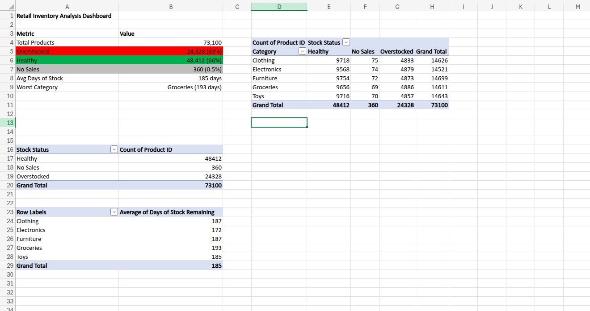

# Retail Inventory Analysis — Stock Level vs Sales Velocity
**Tool:** Microsoft Excel  
**Dataset:** Retail Store Inventory Forecasting Dataset — [Kaggle](https://www.kaggle.com/datasets/anirudhchauhan/retail-store-inventory-forecasting-dataset)

---

## Business Problem

Overstocked products tie up cash and warehouse space. Understocked products mean lost sales and disappointed customers. This analysis answers the question:

**Which products are we sitting on too much of, and are any products at risk of running out — and what should we do about it?**

For e-commerce and retail businesses, inventory management is one of the highest-impact areas for profitability. Getting stock levels right directly affects cash flow, storage costs and customer satisfaction.

---

## Dataset

- **Source:** Kaggle — Retail Store Inventory Forecasting Dataset
- **Size:** 73,100 rows × 15 columns
- **Key columns used:** Product ID, Category, Inventory Level, Units Sold, Units Ordered, Demand Forecast, Price

The dataset covers five product categories — Clothing, Electronics, Furniture, Groceries and Toys — across multiple stores and regions.

---

## Tools Used

- **Microsoft Excel** — calculated columns, pivot tables, conditional formatting dashboard

---

## Methodology

Three calculated columns were added to the raw data to power the analysis:

**1. Daily Sales Velocity**
```
= Units Sold / 30
```
Converts monthly units sold into a daily sales rate to normalise across time periods.

**2. Days of Stock Remaining**
```
= IF(Daily Sales Velocity = 0, "No Sales", Inventory Level / Daily Sales Velocity)
```
Calculates how many days of stock remain at the current sales rate. This is the core metric for identifying overstock and understock risk.

**3. Stock Status**
```
= IF(Days of Stock < 7, "Critical",
  IF(Days of Stock < 30, "Low",
  IF(Days of Stock < 90, "Healthy",
  "Overstocked")))
```
Flags each product row with a traffic light status based on days of stock remaining.

Three pivot tables were built to summarise findings by status and category.

---

## Key Findings

- **33% of all products are overstocked** — 24,328 out of 73,100 product records show more than 90 days of stock remaining. This represents a significant amount of tied-up capital and warehouse space.

- **No products are critically understocked** — the dataset shows no products in the Critical (under 7 days) or Low (under 30 days) categories. This retailer's primary inventory problem is excess stock, not shortage.

- **Average days of stock remaining is 185 days** — across all categories, the business is holding over 6 months of stock on average. This is well above the typical retail target of 30–60 days for most product types.

- **Groceries has the highest average days of stock at 193 days** — particularly concerning given that grocery products are often perishable or time-sensitive. This category represents the most urgent overstocking issue.

- **Electronics has the lowest average at 172 days** — still significantly overstocked, but the best performing category relative to the others.

- **Overstocking is evenly distributed across categories** — each category shows approximately 4,800–4,900 overstocked products, suggesting this is a systemic business-wide issue rather than a category-specific problem.

---

## Stock Status Summary

| Stock Status | Count | % of Total |
|---|---|---|
| Healthy | 48,412 | 66% |
| Overstocked | 24,328 | 33% |
| No Sales | 360 | 0.5% |
| Critical | 0 | 0% |
| Low | 0 | 0% |
| **Total** | **73,100** | **100%** |

---

## Average Days of Stock by Category

| Category | Avg Days of Stock |
|---|---|
| Groceries | 193 |
| Clothing | 187 |
| Furniture | 187 |
| Toys | 185 |
| Electronics | 172 |
| **Overall Average** | **185** |

---

## Business Recommendations

1. **Prioritise Groceries for immediate stock reduction** — at 193 average days, Groceries carries the highest overstocking risk. Promotional discounts, bundle offers or supplier return negotiations should be considered to move excess stock before it expires or loses value.

2. **Review the reordering process business-wide** — the fact that overstocking is evenly spread across all five categories suggests the reorder triggers are set too high across the board. Reducing automatic reorder points and introducing demand-driven ordering would bring average days of stock closer to the 60–90 day target range.

3. **Investigate the 360 No Sales products** — these products are not selling at all. A pricing review, product page audit, or delisting decision should be made for each one to avoid continued storage costs.

4. **Set category-specific stock targets** — Groceries and Clothing should target lower days-of-stock than Furniture and Electronics given their faster turnover and lower storage costs. A one-size-fits-all reorder policy is not appropriate across these categories.

5. **Monitor Days of Stock Remaining as a weekly KPI** — this metric should be tracked on a rolling basis, not just periodically. A live dashboard refreshed weekly would allow the business to catch overstocking before it becomes a cash flow problem.

---

## Dashboard



---

## How to Use

1. Download the dataset from the Kaggle link above
2. Open `retail_inventory_analysis.xlsx`
3. Navigate through the four sheets: **Raw Data → Analysis → Inventory Status → Dashboard**
4. The three calculated columns (Daily Sales Velocity, Days of Stock Remaining, Stock Status) are in columns P, Q and R of the Raw Data sheet
5. Pivot tables on the Analysis sheet can be refreshed by right-clicking → Refresh if the source data changes

---

## About HK Analytics

Data analytics consultancy helping small businesses understand their data.  
[Linktree](https://linktr.ee/hkanalyticsuk) | hello@hkanalytics.co.uk
